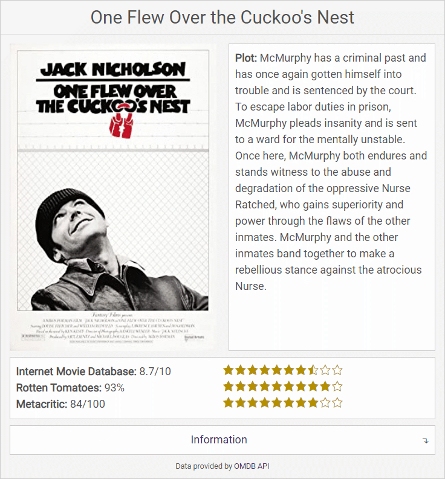

# Movie Shortcode
Do you blog about movies? It can be tedious adding movie information manually, now you can add movie information with shortcode using an IMDB ID.

## About
* Developer: [F13Dev](http://f13dev.com)
* Tags: movie, tv show, episode, embed, shortcode, imdb, omdb
* Requires: WordPress 3.0.1 and up
* Tested to: WordPress 4.5.3
* License: [GPLv3 or later](http://www.gnu.org/licenses/gpl-3.0.html)

## Description
Using Movie Shortcode you can easily add information about a movie, tv show or episode to a blog post.

Simply enter the shortcode: [movie imdb="an IMDB ID"] or [Movie title="A Movie Title"] to a blog post to add an array of information about the movie, tv show or episode.

Optional attributes:
* cachetime="A time in minutes" - default is 1440 (24 hours)
* plot="short|full" - default is full

If adding the shortcode with a title, rather than an IMDB ID, the following attributes are also optional to find the correct entry:
* type="movie|series|episode"
* year="The year of the movie"

Features:
* Styled appearance
* Shows film title, year, release date
* If showing a series, the total number of seasons is displayed
* If showing an episode, the season and episode number are displayed
* Displays the plot or synopsis
* Displays a poster image if one is available
* If a poster image is available it is added to your media library and loaded locally
* Displays movie stats such as the runtime, genre, awards, director, writer, Actors
* Displays the available languages and country of origin
* Provides the IMDB rating, including a star rating image
* Adds a link to the movie on IMDB
* Utilizes transient caching to reduce page load times and api calls

## Installation
1. Upload the plugin files to the `/wp-content/plugins/plugin-name` directory, or install the plugin through the WordPress plugins screen directly.
2. Activate the plugin through the 'Plugins' screen in WordPress
3. Add the shortcode [movie imdb="an IMDB ID"], or [movie title="A movie title"] to the desired location on your blog

## Frequently Asked Questions
Q) How do I find an IMDB ID

A) When viewing a movie, tv show or episode on IMDB.com, the ID is the string starting with 'tt', usually in the format www.imdb.com/title/imdbid/

Q) How do I adjust the cache time

A) Add the attribute cachetime="a time in minutes" to your shortcode

Q) Using the shortcode with a title returns the wrong movie

A) Try adding the optional attributes, type="movie|series|episode" and year="a year" to refine your search result

## Screenshots

The results of adding [movie imdb="tt0480249"] to a blog post.

## Changelog

### 1.0
* Initial release
